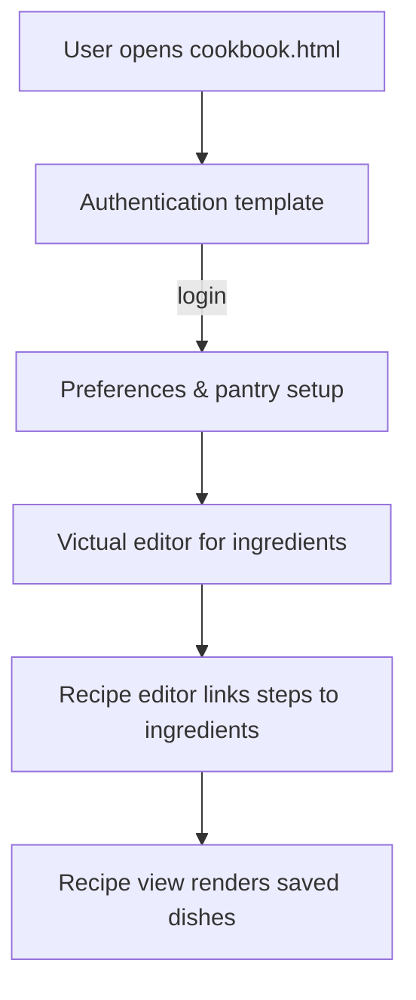

# Cookbook App Overview

## Use Case
- **Project overview:** A client-side cookbook (HTML/CSS/JS) that lets authenticated users capture pantry inventory, attach ingredients to recipe steps, and review ready-to-cook dishes.
- **Problem description:** Busy home cooks waste time re-buying items and lose track of which recipes match the ingredients on hand; this app connects pantry state to recipe instructions so shopping and cooking stay aligned.
- **Most challenging issue:** Maintaining consistent pantry/recipe/tab state without a frontend framework or backend.
- **How it was solved:** Split the UI into small vanilla JS modules so each tab renders its own template without leaking state, anchored everything to a tiny event-driven store that emits updates to all tabs, and persisted normalized pantry/recipe records in localStorage (per-key TTL checks + JSON schema guards) so a refresh reloads the exact same state.

## Flow Diagram

